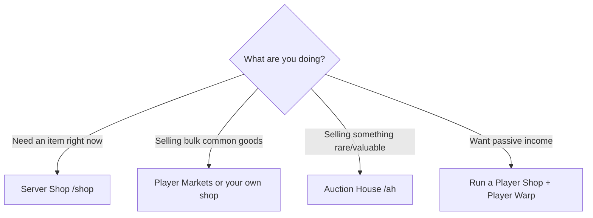

# Shops & Markets

TownifyMC has a full player-driven economy with several ways to **buy and sell**. Here's how each one works and when to use it.

## The server shop

The **server shop** is your reliable baseline — it buys and sells common items at fixed prices, always available.

```
/shop           # open the server shop
```

- **Buying:** get items instantly at a set price. Handy for materials you don't want to gather.
- **Selling:** offload gathered goods for a guaranteed payout. The price is fixed, so you always know what you'll get.

!!! tip "The server shop sets the floor"
    Server-shop sell prices are the *floor* for the economy. If you can sell the same item to **players** for more, do that. If you need something *now*, the server shop is the fastest option even if it's not the cheapest.

## Player markets

Beyond the server shop, TownifyMC runs **player markets** — a marketplace where players list goods for others to buy. This is where supply, demand, and real prices live.

```
/market         # browse player markets :material-wrench:
/markets        # alternative :material-wrench:
```

Categories cover the full range — building blocks, tools, food, decoration, and more. Browse before you buy from the server shop; you'll often find a better deal from another player.

## Setting up your own shop

Want **passive income**? Run your own storefront so players can buy from you even while you're offline.

To set up a shop you'll generally need:

1. **A town plot** you own (or permission to build in one). See [Creating a Town](../towns/towns.md).
2. **Stock** — items players actually want.
3. **A shop setup** — typically chest shops or a market listing, depending on the system.

!!! tip "What sells well"
    - **Building blocks** in bulk (always in demand for big builds)
    - **Food** (everyone needs to eat)
    - **Enchanted gear and books**
    - **Rare drops and event items**
    - **Spawners** and farm products

Price competitively — undercut the server shop and watch your neighbors' prices. A well-stocked, fairly-priced shop in a busy town is excellent passive money.

### Get more foot traffic with Player Warps

TownifyMC has **player warps**, which let you create a public warp point others can teleport to — perfect for driving customers to your shop.

```
/pwarp          # browse player warps
/pwarp set <name>    # create a warp (rank-gated) :material-wrench:
```

The number of player warps you can own scales with your [rank](../progression/ranks.md): your first at **Count (#20)**, a second at **Jarl (#21)**, and up to **5 at Royal (#25)**. A warp named for your shop ("MegaBuild Blocks") pulls in buyers from across the map.

## The auction house

For **rare, high-value, one-off items**, use the auction house — list something and let the whole server bid or buy it.

```
/ah             # open the auction house
/ah sell <price>     # list the item in your hand
```

- Best for items a fixed-price shop would **undervalue** — rare gear, special drops, event items.
- The whole server sees your listing, so you get true market value.
- Check `/ah` regularly for deals — other players list valuable things too, and bargains go fast.

## Which should I use?



| Situation | Use |
|-----------|-----|
| Need an item immediately | **Server shop** (`/shop`) |
| Selling lots of common items | **Player markets** / your own shop |
| Selling a rare, valuable item | **Auction house** (`/ah`) |
| Building passive income | **Your own shop** + a **player warp** |

---

**Next:** [Fishing →](fishing.md)
