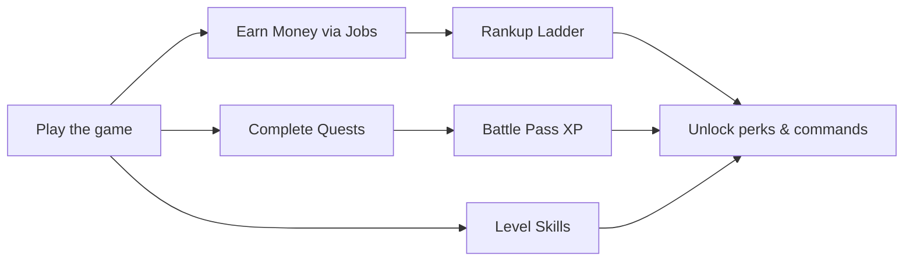

# Ranks & Progression

TownifyMC has multiple parallel progression systems. You don't have to engage with all of them, but together they give you plenty to chase.

-   :material-trophy: **[The Rank Ladder](ranks.md)**

    ---

    27 ranks from Pleb to Celestial, each unlocking new commands and perks. Money-gated, climbed with `/rankup`.

-   :material-cash: **[Economy & Currencies](economy.md)**

    ---

    Money and Gems — what each one is and how to earn it.

-   :material-pickaxe: **[Jobs](jobs.md)**

    ---

    12 jobs that pay you for the things you already do. Your main income source.

-   :material-sword-cross: **[Skills](skills.md)**

    ---

    RPG-style skills that level up as you play and grant passive bonuses.

-   :material-calendar-check: **[Quests & Battle Pass](quests.md)**

    ---

    Daily quests, login rewards, and a seasonal battle pass with free and premium tracks.

## How it all fits together

The **rank ladder** is the backbone — it's driven by **money**, which mostly comes from **jobs**. Everything else (skills, quests, battle pass, voting) layers extra rewards and progression on top.
