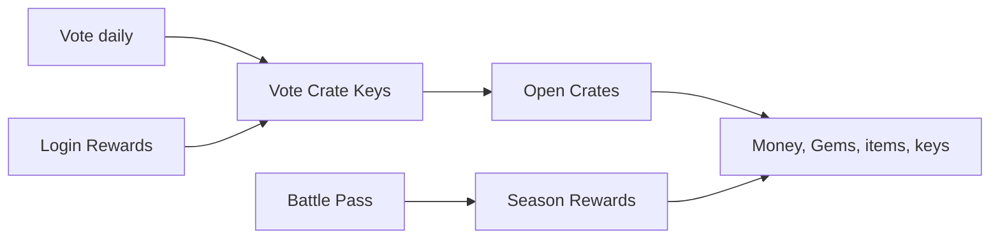

# Rewards

TownifyMC rewards players through voting, crates, login rewards, Battle Pass rewards, events, and the server store.

-   :material-star: **[Voting](voting.md)**

    ---

    Vote daily on six listing sites to earn Vote Crate keys.

-   :material-treasure-chest: **[Crates](crates.md)**

    ---

    Eight configured crates, from Vote Crate rewards to premium and special crates.

## The reward loop

