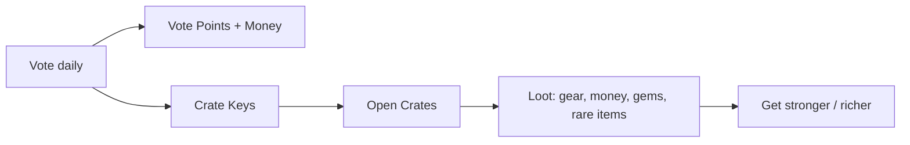

# Rewards

Free stuff! TownifyMC rewards you just for showing up and supporting the server. The two big systems here are **voting** (free daily rewards) and **crates** (loot boxes with the server's best items).

-   :material-star: **[Voting](voting.md)**

    ---

    Vote for the server daily to earn money, Vote Points, and crate keys. The best free rewards on the server.

-   :material-treasure-chest: **[Crates](crates.md)**

    ---

    Seven kinds of crates, from the everyday Vote Crate to the prestigious King's Crate.

## The daily reward loop

Voting feeds you crate keys, crates give you loot, loot makes you stronger and richer. It costs nothing but a minute a day — there's no reason not to do it.
