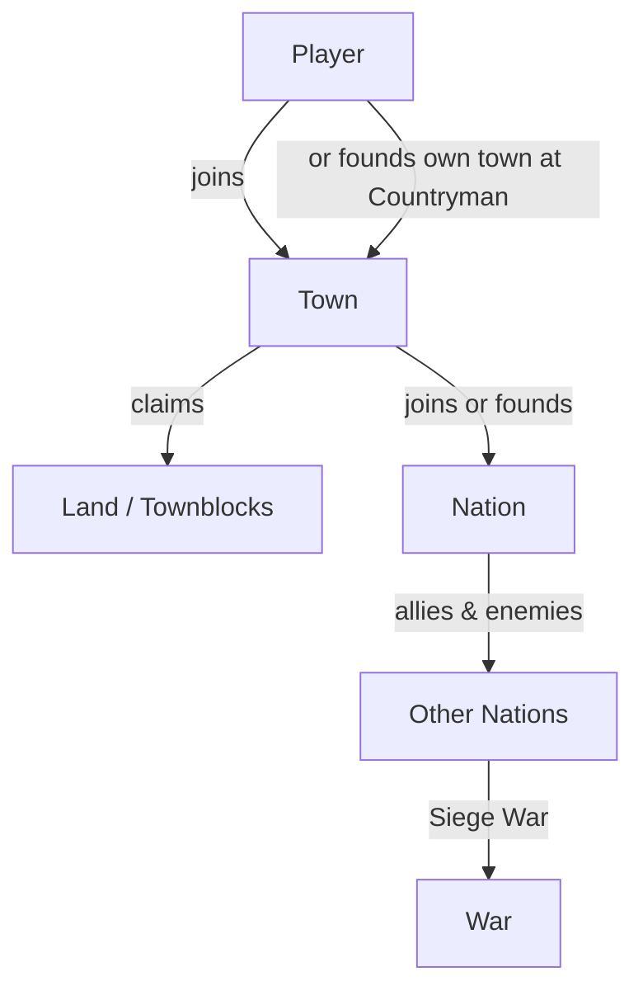

# Towns & Nations

Towny is the heart of TownifyMC. It's how you **claim and protect land**, build with friends, and project power across the map. This is where a survival server becomes a world of rival settlements.

-   :material-home-city: **[Creating a Town](towns.md)**

    ---

    Found a town, claim land, invite residents, set taxes, and protect your builds.

-   :material-flag-variant: **[Nations](nations.md)**

    ---

    Unite multiple towns under one banner. Alliances, enemies, and shared identity.

-   :material-castle: **[Sieges & War](war.md)**

    ---

    The official way to wage war — capture enemy towns through the Siege War system.

## The big picture

- A **town** is owned land where you and your residents are protected from griefing.
- Multiple towns can join a **nation** for a shared identity, diplomacy, and strength.
- Nations interact through **diplomacy and war**, including the [Siege War](war.md) system.

## Two ways to play Towny

You don't *have* to found your own town:

=== "Join an existing town"

    **The easy mode for new players.** Find a town that's recruiting (ask in [Discord](https://discord.gg/townifymc) or browse the [live map](https://map.townifymc.xyz)), and join it. You get:

    - Instant protected land to build on
    - No upfront town/claim costs
    - A ready-made community

    Use `/town join <town>` (if open) or ask the mayor for an invite.

=== "Found your own town"

    **For the ambitious.** You'll need to reach **Countryman (#5)** to unlock town creation, then pay the town cost. You get full control — but also the responsibility of funding and growing it. See [Creating a Town](towns.md).

---

**Start here:** [Creating a Town →](towns.md)
