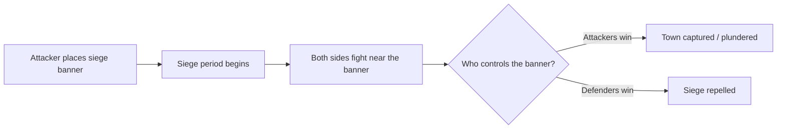

# Sieges & War

War on TownifyMC happens through the official **Siege War** system. This is the *only* sanctioned way to attack another town — no tunneling under claims, no trapping players, no "unofficial" raids. Siege War turns conflict into a structured, fair, server-supported event.

!!! warning "Read the rules first"
    Working around town protection to grief or raid outside the Siege War system is against the [server rules](../getting-started/rules.md) and can get you banned. Keep it in the system.

## What is a siege?

A **siege** is a formal military assault on a town. An attacking nation starts a siege at a target town, and over a period of time the two sides fight for control of a **siege banner**. The outcome is decided by who dominates the battle — not by destroying the town's builds.

The key idea: **Siege War doesn't let attackers grief your buildings.** Even if you lose a siege, your town isn't bulldozed. What's at stake is control, plunder, and pride — not your hard work.

## How a siege plays out

1. **Declaration:** an attacking nation places a **siege banner** near the target town to begin the siege.
2. **The siege period:** over a set duration, players from both sides battle around the banner. Presence and kills shift the **siege balance** toward whichever side is winning.
3. **Resolution:** when the timer ends, the leading side wins:
    - **Attackers win** → they can **plunder** the town's bank and/or force it into submission.
    - **Defenders win** → the siege is broken and the town stays free.

## Attacking

Before you start a siege, make sure you're ready:

- You'll need a **nation** and ideally **allies** to field enough players.
- Sieges are won by **showing up and fighting** — coordinate your members for the siege window.
- There are costs and cooldowns involved, so don't declare frivolously.

## Defending

If your town is besieged:

- **Rally your residents and allies** — defense is a numbers game.
- Hold the area around the **siege banner**; control of that point decides the outcome.
- Coordinate in voice/[Discord](https://discord.gg/townifymc) — organized defenders beat disorganized attackers.

!!! tip "Strength in alliances"
    This is *why* [nations and alliances](nations.md) matter. A lone town is vulnerable; a well-allied nation can call in reinforcements when the banners go up.

## Staying out of war

Not interested in PvP and sieges? You have options:

- **Town/Nation neutrality** — declare neutrality (for a fee) to opt out of conflicts.
- **Towny Pacifist** — TownifyMC runs the Pacifist add-on, letting towns take a pacifist stance.

Talk to staff or check the in-game menus for exactly how neutrality and pacifism interact with sieges on TownifyMC.

---

!!! quote "The spirit of Siege War"
    It's competitive, organized conflict — high stakes for your bank and your reputation, but **never** a license to destroy someone's builds. Win or lose, everyone's work survives.

---

**Related:** [Nations](nations.md) · [Server Rules](../getting-started/rules.md)
